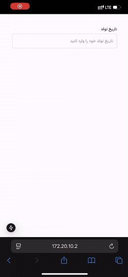

# Nikaat Wheel Datepicker

## 🎥 Demo

### Jalali Calendar


### Gregorian(miladi) Calendar


A modern date picker component with a wheel picker interface, supporting both **Jalali (Persian)** and **Gregorian** calendars, with full **RTL support**.

## Features

- Support for both **Jalali (Persian)** and **Gregorian (miladi)** calendars
- Wheel picker interface for smooth and intuitive date selection
- RTL (Right-to-Left) support for Persian/Arabic layouts
- Customizable year range
- Modal-based user interface
- Responsive and mobile-friendly design

## Installation

```bash
npm install wheel-datepicker
```

## Usage

### Basic Usage

```tsx
import WheelDatePicker from 'wheel-datepicker';

function App() {
  const [date, setDate] = useState('');

  return (
    <WheelDatePicker
      value={date}
      onChange={setDate}
    />
  );
}
```

### With RTL Support

```tsx
import WheelDatePicker from 'wheel-datepicker';

function App() {
  const [date, setDate] = useState('');

  return (
    <WheelDatePicker
      value={date}
      onChange={setDate}
      rtl={true}
      inputProps={{ label: "انتخاب تاریخ" }}
    />
  );
}
```

### With Custom Year Range

```tsx
<WheelDatePicker
  value={date}
  onChange={setDate}
  minYear={1350}
  maxYear={1410}
  inputProps={{ label: "Custom Year Range" }}
/>
```

## Props

| Prop | Type | Default | Description |
|------|------|---------|-------------|
| `value` | `string` | - | The selected date in 'jYYYY/jMM/jDD' format |
| `onChange` | `(date: string) => void` | - | Callback when date changes |
| `minYear` | `number` | `1300` | Minimum selectable year |
| `maxYear` | `number` | Current year | Maximum selectable year |
| `rtl` | `boolean` | `false` | Enable RTL (Right-to-Left) layout |
| `className` | `string` | - | Additional CSS class for the component |
| `inputProps` | `InputProps` | - | Props for the input field |
| `wheelPickerProps` | `WheelPickerProps` | - | Props for wheel picker components |
| `modalProps` | `ModalProps` | - | Props for the modal |
| `buttonProps` | `ButtonProps` | - | Props for the confirm button |

## RTL Support

When `rtl={true}` is set:

- Text direction changes to right-to-left
- Wheel picker order changes to: Year → Month → Day (instead of Day → Month → Year)
- All text alignment adjusts for RTL layout
- Modal and input components adapt to RTL direction

## License

MIT
