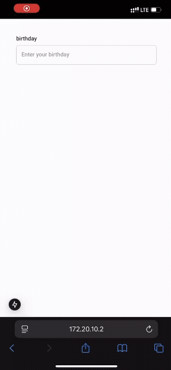

<br/>
<div align="center">
<svg version="1.1" id="Uploaded to svgrepo.com" xmlns="http://www.w3.org/2000/svg" xmlns:xlink="http://www.w3.org/1999/xlink" 
	 width="80px" height="80px" viewBox="0 0 32 32" xml:space="preserve">
<style type="text/css">
	.isometric_vijf{fill:#F29227;}
	.isometric_zes{fill:#F28103;}
	.isometric_zeven{fill:#FF7344;}
	.isometric_acht{fill:#F05A28;}
	.isometric_negen{fill:#BE1E2D;}
	.isometric_tien{fill:#7BD6C4;}
	.isometric_elf{fill:#72C0AB;}
	.isometric_twaalf{fill:#569080;}
	.st0{fill:#225B49;}
	.st1{fill:#F8F7C5;}
	.st2{fill:#BE1E2D;}
	.st3{fill:#AD9A74;}
	.st4{fill:#F2D76C;}
	.st5{fill:#F5DF89;}
	.st6{fill:#7BD6C4;}
	.st7{fill:#80CCBE;}
</style>
<g>
	<line class="isometric_twaalf" x1="10" y1="20.356" x2="16" y2="16.923"/>
	<polygon class="isometric_acht" points="4,16.915 10,13.466 16,16.923 10,20.356 	"/>
	<polygon class="isometric_negen" points="10,28 16,24.536 16,16.923 10,20.356 	"/>
	<line class="isometric_twaalf" x1="10" y1="20.356" x2="16" y2="16.923"/>
	<polygon class="isometric_acht" points="4,16.915 10,13.466 16,16.923 10,20.356 	"/>
	<polygon class="isometric_negen" points="10,28 16,24.536 16,16.923 10,20.356 	"/>
	<polygon class="isometric_zeven" points="10,28 4,24.536 4,16.915 10,20.356 	"/>
	<line class="isometric_twaalf" x1="22" y1="20.379" x2="27.962" y2="16.915"/>
	<polygon class="isometric_zes" points="16,16.923 21.962,13.456 27.962,16.915 22,20.379 	"/>
	<polygon class="isometric_vijf" points="22,28 16,24.536 16,16.923 22,20.379 	"/>
	<polygon class="isometric_acht" points="22,28 27.962,24.536 27.962,16.915 22,20.379 	"/>
	<line class="isometric_twaalf" x1="16" y1="9.323" x2="21.962" y2="5.865"/>
	<polygon class="isometric_elf" points="10,5.865 16.037,2.406 21.962,5.865 16,9.323 	"/>
	<polygon class="isometric_twaalf" points="16,16.923 21.962,13.456 21.962,5.865 16,9.323 	"/>
	<polygon class="isometric_tien" points="16,16.923 10,13.466 10,5.865 16,9.323 	"/>
</g>
</svg>
<h3 align="center">@buildix/wheel-datepicker</h3>


<br/>
<p align="center">
A modern date picker component with a wheel picker interface, supporting both **Jalali (Persian)**
and **Gregorian (Mialdi)** calendars, with full **RTL support**.
<br/>
<br/>
<a href="https://wheel-datepicker.vercel.app/" target="_blank" rel="noopener noreferrer">
  <strong>View full documentation on Storybook »</strong>
</a>
<br/>
<br/>
</p>
</div>

## 🎥 Demo

<div>
  
  
</div>

## ✨ Features

- ✅ Support for both **Jalali (Persian)** and **Gregorian (Miladi)** calendars
- 🎡 Smooth and intuitive **wheel-style date selection**
- 🌐 Full **RTL (Right-to-Left)** support for Persian/Arabic languages
- 🖼 **Modal-based interface** with customizable open direction:
  - Open from **center** or **bottom** of the screen
- 🔧 Customizable **year range**
- 🎨 Custom input, button, and modal props for full UI control
- 📱 **Responsive** and mobile-friendly design

## Installation

```bash
npm install @buildix/wheel-datepicker
```

## Import CSS

```tsx
import '@buildix/wheel-datepicker/dist/index.css';
```

## Usage

### Basic Usage

```tsx
import { WheelDatePicker } from '@buildix/wheel-datepicker';
import '@buildix/wheel-datepicker/dist/index.css';

function App() {
  const [date, setDate] = useState('');

  return <WheelDatePicker value={date} onChange={setDate} />;
}
```

### With Custom Year Range

```tsx
<WheelDatePicker
  value={date}
  onChange={setDate}
  minYear={1350}
  maxYear={1410}
  inputProps={{ label: 'Custom Year Range' }}
/>
```

## Props

### datepicker props

| Prop                       | Type                   | Default                   | Description                                             |
| -------------------------- | ---------------------- | ------------------------- | ------------------------------------------------------- |
| `value`                    | string                 | -                         | The selected date in jYYYY/jMM/jDD or YYYY/MM/DD format |
| `onChange`                 | (date: string) => void | -                         | Callback when date changes                              |
| `minYear`                  | number                 | jalali(1300) miladi(1500) | Minimum selectable year                                 |
| `maxYear`                  | number                 | Current year              | Maximum selectable year                                 |
| `calendarType`             | miladi - jalali        | jalali                    | Calendar type                                           |
| `visibleCount`             | 1, 3, 5 , 7            | 3                         | Count of visible item in Calendar                       |
| `itemHeight`               | number                 | 40px                      | Height of calendar item                                 |
| `indicatorBorderColor`     | string                 | #e0e0e0                   | Indicator top and bottom border color                   |
| `indicatorBorderWidth`     | string                 | 1px                       | Indicator top and bottom border width                   |
| `className`                | string                 | -                         | Additional CSS class for the component                  |
| `indicatorClassName`       | string                 | -                         | Additional CSS class for the component                  |
| `scrollContainerClassName` | string                 | -                         | Additional CSS class for the component                  |
| `itemClassName`            | string                 | -                         | Additional CSS class for the component                  |
| `input`                    | `InputProps`           | -                         | Props for the input field                               |
| `modal`                    | `ModalProps`           | -                         | Props for the modal                                     |
| `button`                   | `ButtonProps`          | -                         | Props for the confirm button                            |

### modal props

| Prop        | Type           | Default | Description                            |
| ----------- | -------------- | ------- | -------------------------------------- |
| `title`     | string         | -       | Modal title                            |
| `placement` | bottom, center | bottom  | Open modal placement                   |
| `closeIcon` | reactNode      | '×'     | modal close icon                       |
| `className` | string         | -       | Additional CSS class for the component |

### input props

| Prop          | Type    | Default | Description                            |
| ------------- | ------- | ------- | -------------------------------------- |
| `label`       | string  | -       | Input label                            |
| `placeholder` | string  | -       | Input placeholder                      |
| `disabled`    | boolean | false   | Disable Input                          |
| `name`        | string  | -       | Input name                             |
| `error`       | string  | -       | Input error helper text                |
| `className`   | string  | -       | Additional CSS class for the component |

### button props

| Prop        | Type                 | Default                    | Description                            |
| ----------- | -------------------- | -------------------------- | -------------------------------------- |
| `size`      | small, medium, large | medium                     | Button size                            |
| `text`      | string               | jalali(تایید), miladi(set) | Button text content                    |
| `className` | string               | -                          | Additional CSS class for the component |

## License

MIT

## buy me a coffee

<a href="https://www.coffeebede.com/sadegh79"></a>
